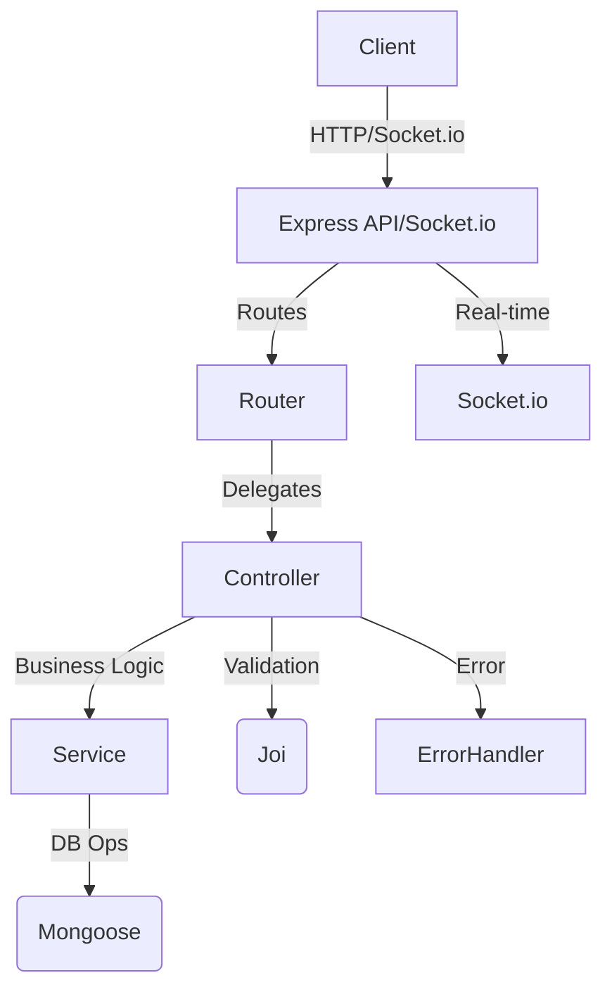
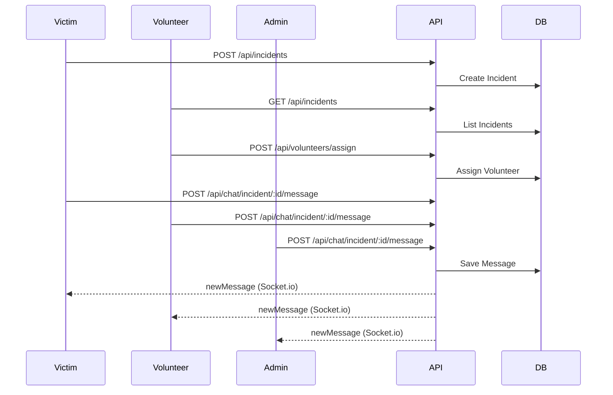

# DRCP Backend Documentation

---

## 1. **Architecture Overview**

- **Tech Stack:** Node.js, Express, MongoDB (Mongoose), JWT, Joi, Socket.io
- **Structure:** Modular (controllers, services, routes, models, validators, middlewares, errorHandler, utils/tests)
- **Main Features:** User management, incidents, volunteers, resources/donations, chat (real-time), admin, validation, error handling

---

## 2. **Routing & API Endpoints**

### **User/Auth**
| Method | Endpoint                | Description                        | Auth Required | Sample Output |
|--------|-------------------------|------------------------------------|--------------|--------------|
| POST   | `/api/users/register`   | Register user (victim/volunteer/admin) | No           | `{ user, token }` |
| POST   | `/api/users/login`      | Login user                         | No           | `{ user, token }` |
| GET    | `/api/users/profile`    | Get current user profile           | Yes          | `{ status: 'success', user }` |
| PATCH  | `/api/users/profile`    | Update profile (location, status)  | Yes          | `{ user }` |
| DELETE | `/api/users/:userId`    | Delete user (if not assigned)      | Yes          | `{ status: 'success', message: 'User deleted' }` |

### **Incident**
| Method | Endpoint                        | Description                        | Auth Required | Sample Output |
|--------|---------------------------------|------------------------------------|--------------|--------------|
| GET    | `/api/incidents`                | List all incidents                 | Yes          | `{ incidents: [...] }` |
| POST   | `/api/incidents`                | Create new incident                | Yes          | `{ incident }` |
| GET    | `/api/incidents/:incidentId`    | Get incident by ID                 | Yes          | `{ incident }` |
| PATCH  | `/api/incidents/:incidentId`    | Update incident                    | Yes          | `{ incident }` |
| DELETE | `/api/incidents/:incidentId`    | Delete incident                    | Yes          | `{ status: 'success', message: 'Incident deleted' }` |
| POST   | `/api/incidents/:incidentId/reports` | Add victim report             | Yes          | `{ report }` |
| GET    | `/api/incidents/:incidentId/reports` | List all reports               | Yes          | `{ reports: [...] }` |
| POST   | `/api/incidents/:incidentId/assign`  | Assign volunteer to incident   | Yes          | `{ assigned: true }` |
| GET    | `/api/incidents/:incidentId/volunteers` | List volunteers for incident | Yes          | `{ volunteers: [...] }` |

### **Volunteer**
| Method | Endpoint                        | Description                        | Auth Required | Sample Output |
|--------|---------------------------------|------------------------------------|--------------|--------------|
| POST   | `/api/volunteers/assign`        | Assign self to incident            | Yes          | `{ assigned: true }` |
| GET    | `/api/volunteers/assigned-incidents` | List assigned incidents      | Yes          | `{ incidents: [...] }` |

### **Resource/Donation**
| Method | Endpoint                        | Description                        | Auth Required | Sample Output |
|--------|---------------------------------|------------------------------------|--------------|--------------|
| POST   | `/api/resources/donate`         | Donate a resource                  | Yes          | `{ donation }` |
| GET    | `/api/resources`                | List all resources                 | Yes          | `{ resources: [...] }` |
| GET    | `/api/resources/:resourceId`    | Get resource by ID                 | Yes          | `{ resource }` |
| POST   | `/api/resources/allocate`       | Allocate resource to incident      | Yes          | `{ resource }` |
| GET    | `/api/resources/history`        | Get donation history               | Yes          | `{ history: [...] }` |

### **Chat (REST & Socket.io)**
| Method | Endpoint                        | Description                        | Auth Required | Sample Output |
|--------|---------------------------------|------------------------------------|--------------|--------------|
| GET    | `/api/chat/incident/:incidentId`| Get all chat messages for incident | Yes          | `{ messages: [...] }` |
| POST   | `/api/chat/incident/:incidentId/message` | Send chat message         | Yes          | `{ message }` |

**Socket.io Events:**
- `joinIncident` (join a chat room)
- `sendMessage` (send message, broadcast to room)
- `newMessage` (receive new message in real-time)

---

## 3. **Code Flow & Layered Structure**



- **Routes:** Define endpoints, attach validators, and call controllers.
- **Controllers:** Thin, handle request/response, delegate to services, handle errors.
- **Services:** All business logic, DB queries, transactions.
- **Models:** Mongoose schemas for all resources.
- **Validators:** Joi schemas for input validation.
- **Middlewares:** Auth, role checks, error handling, etc.
- **Socket.io:** Real-time chat and notifications.

---

## 4. **Sample Workflows**

### **User Registration & Login**
1. `POST /api/users/register` → Validates input → Creates user → Returns `{ user, token }`
2. `POST /api/users/login` → Validates input → Checks credentials → Returns `{ user, token }`

### **Incident Reporting & Assignment**
1. Victim reports incident: `POST /api/incidents`
2. Volunteers see open incidents: `GET /api/incidents`
3. Volunteer assigns self: `POST /api/volunteers/assign`
4. Victim/volunteer/admin chat in real-time: `POST /api/chat/incident/:incidentId/message` (REST or Socket.io)

### **Resource Donation & Allocation**
1. User donates resource: `POST /api/resources/donate`
2. Admin allocates resource: `POST /api/resources/allocate`
3. Victim/volunteer sees available resources: `GET /api/resources`

### **Chat**
- All assigned users join incident room via Socket.io.
- Send/receive messages in real-time.
- Fetch chat history via REST.

---

## 5. **Testing**

- **Unit & Integration:** Jest + Supertest for all modules.
- **System Test:** Full workflow (register, incident, assign, donate, allocate, chat, delete, etc.)
- **Edge Cases:** Unauthorized access, invalid data, deletion while assigned, etc.

**Sample Test Output:**
```json
{
  "user": {
    "_id": "abc123",
    "name": "Victim1",
    "role": "victim",
    "email": "victim1@example.com"
  },
  "token": "eyJhbGciOiJIUzI1NiIsInR5cCI6IkpXVCJ9..."
}
```
```json
{
  "incident": {
    "_id": "def456",
    "title": "Flood in Area",
    "status": "open",
    "victims": ["abc123"],
    "volunteers": []
  }
}
```
```json
{
  "messages": [
    { "sender": { "name": "Victim1" }, "message": "Help needed!", "sentAt": "..." }
  ]
}
```

---

## 6. **Controllers & Services**

- **Controllers:** Thin, only handle HTTP, call services, catch errors.
- **Services:** All business logic, DB ops, validation, error throwing.
- **Error Handling:** All errors passed to centralized error handler.

---

## 7. **Diagrams**

### **Incident Assignment & Chat Flow**



---

## 8. **Best Practices**

- All input validated (Joi/Mongoose)
- All errors handled centrally
- All business logic in services
- All sensitive routes protected by JWT auth
- Real-time chat via Socket.io
- Modular, maintainable codebase

---

## 9. **How to Run**

1. Install dependencies: `npm install`
2. Set up `.env` with MongoDB URI and JWT secret
3. Start server: `npm start`
4. Run tests: `npm test`

---

## 10. **Further Improvements**

- Add Swagger/OpenAPI docs
- Add more admin endpoints
- Add more real-time notifications (resource allocation, incident status)
- Add rate limiting, monitoring, logging

---

## 11. **Quick Start Commands**

```bash
# Install dependencies
npm install

# (or if using pnpm)
pnpm install

# Run the server (development)
npm start

# Run the server (production, if applicable)
npm run prod

# Run all tests (unit, integration, system)
npm test

# Lint the code (if you have a linter)
npm run lint
```

---